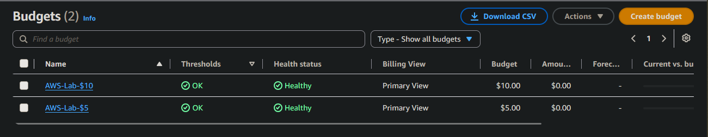
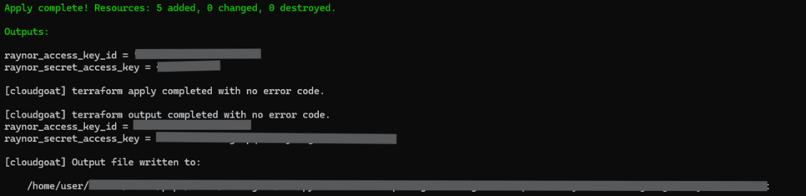
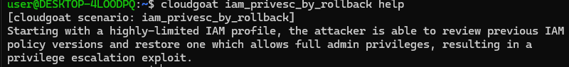
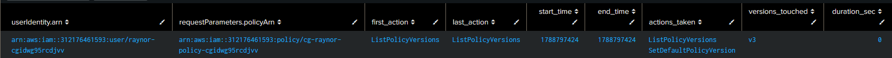
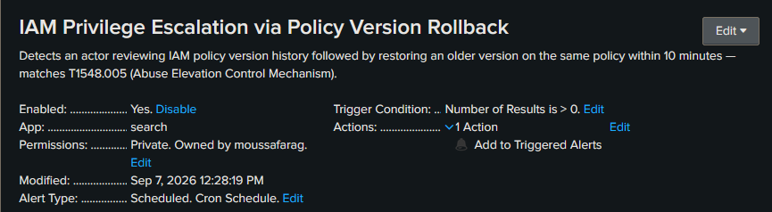
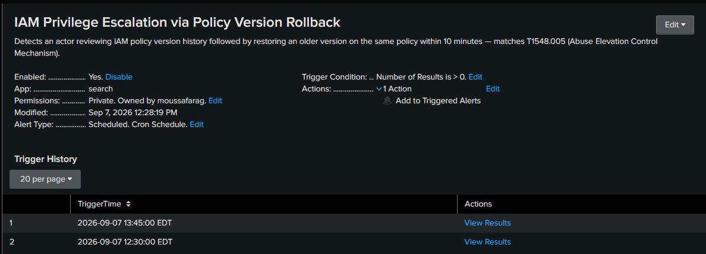

# AWS IAM Privilege Escalation — Detection & Incident Response

## Summary
Deployed a deliberately vulnerable AWS IAM configuration (CloudGoat's `iam_privesc_by_rollback` scenario) and, operating as a restricted IAM user, identified and exploited a flaw allowing escalation from read-only IAM access to full administrative privileges by abusing the `iam:SetDefaultPolicyVersion` permission. Escalation was confirmed end-to-end via a before/after cross-service access test. The resulting activity was then investigated from the defender's side: retrieved from AWS CloudTrail, ingested into Splunk, and used to build and operationalize a real detection — a scheduled Splunk alert that was confirmed firing against the captured log data.

## Authorized Lab Disclaimer
All activity in this repository was performed against infrastructure I built, own, or was explicitly authorized to test (isolated VMs / a personal AWS sandbox account). No production systems, third-party assets, or real user data were accessed. Published for educational and professional-demonstration purposes only.

## Environment / Architecture
- AWS account: personal lab account, isolated from any production use, with $5/$10 monthly budget alerts configured
- Scenario: CloudGoat `iam_privesc_by_rollback`, deployed via Terraform
- IAM user `raynor-cgidwg95rcdjvv`: low-privilege attacker persona, granted only `iam:Get*`, `iam:List*`, and `iam:SetDefaultPolicyVersion`
- Customer-managed IAM policy `cg-raynor-policy-cgidwg95rcdjvv`, retaining 5 historical versions
- Two local AWS CLI profiles used throughout: `default` (the `lab-admin` IAM user — builder/defender identity) and `raynor` (attacker identity), kept strictly separate
- Splunk Enterprise (local instance), with a dedicated `aws_cloudtrail` index holding reshaped CloudTrail log data


*Budget alarms set at $5 and $10 monthly thresholds — configured before any lab resources were deployed.*


*Confirmation that CloudGoat provisioned the IAM user, policy, and version history described above.*

## Objective & Scope
Determine whether the IAM user Raynor could escalate from his granted read-only IAM permissions to full administrative access by abusing IAM policy version history; confirm the escalation with a working proof; and, from the defender's perspective, determine whether the activity was logged, build a detection that would catch it, and document remediation. Testing was limited to the CloudGoat-provisioned resources listed above.


*Scenario documentation reviewed before deployment to confirm scope and rules of engagement.*

## Methodology
1. Deployed the CloudGoat `iam_privesc_by_rollback` scenario via Terraform, provisioning the IAM user and policy described above.
2. Configured a dedicated AWS CLI profile for Raynor, kept separate from the administrative profile used to build the lab.
3. Enumerated IAM policies attached to Raynor's user via `iam:ListAttachedUserPolicies`.
4. Listed all 5 saved versions of the attached policy via `iam:ListPolicyVersions` to identify exposed version history.
5. Retrieved and reviewed the JSON document for each of the 5 policy versions individually to determine the actual permissions each one granted.

**Policy version enumeration:**

| Version | Default | Created (UTC) | What it grants |
|---|---|---|---|
| v1 | ✅ (active) | 2026-09-04 04:44:20 | `iam:Get*`, `iam:List*`, `iam:SetDefaultPolicyVersion` — Raynor's actual starting permissions |
| v2 | — | 2026-09-04 04:44:21 | Decoy — Deny-all scoped to unrelated source IPs |
| v3 | — | 2026-09-04 04:44:22 | **Full admin** (`Action: *` / `Resource: *`) — the escalation target |
| v4 | — | 2026-09-04 04:44:22 | Decoy — `iam:Get*` restricted to an expired 2017 date range |
| v5 | — | 2026-09-04 04:44:23 | Decoy — 3 read-only S3 actions |

`evidence/03-policy-v1-baseline.json` — the active (v1) version at the time of testing:
```json
{
    "PolicyVersion": {
        "Document": {
            "Statement": [
                {
                    "Action": [
                        "iam:Get*",
                        "iam:List*",
                        "iam:SetDefaultPolicyVersion"
                    ],
                    "Effect": "Allow",
                    "Resource": "*",
                    "Sid": "IAMPrivilegeEscalationByRollback"
                }
            ],
            "Version": "2012-10-17"
        },
        "VersionId": "v1",
        "IsDefaultVersion": true,
        "CreateDate": "2026-09-04T04:44:20+00:00"
    }
}
```

`evidence/04-admin-policy-version.json` — the v3 version reviewed during enumeration (this is what gets restored during the exploit):
```json
{
    "PolicyVersion": {
        "Document": {
            "Version": "2012-10-17",
            "Statement": [
                {
                    "Action": "*",
                    "Effect": "Allow",
                    "Resource": "*"
                }
            ]
        },
        "VersionId": "v3",
        "IsDefaultVersion": false,
        "CreateDate": "2026-09-04T04:44:22+00:00"
    }
}
```

Full raw version list: [`evidence/03a-policy-versions-list.json`](evidence/03a-policy-versions-list.json)

6. Established a permission baseline by attempting `ec2:DescribeInstances` under Raynor's original policy version (`v1`) — confirmed denied with `UnauthorizedOperation`.
7. Executed the privilege escalation by calling `iam:SetDefaultPolicyVersion` to set `v3` (unrestricted `Action: *` / `Resource: *`) as the active policy version.
8. Re-tested the identical `ec2:DescribeInstances` call, which succeeded — confirming successful escalation from a read-only IAM scope to full administrative access.

**Before/after escalation proof:**

`evidence/05-before-escalation-denied.txt` — baseline test under v1 (denied):
```
An error occurred (UnauthorizedOperation) when calling the DescribeInstances operation: You are not authorized to perform this operation. User: arn:aws:iam::123456789012:user/raynor-cgidwg95rcdjvv is not authorized to perform: ec2:DescribeInstances because no identity-based policy allows the ec2:DescribeInstances action
```

`evidence/06-after-escalation-success.txt` — identical test after restoring v3 (succeeded):
```
{
    "Reservations": []
}
```

9. Confirmed the escalation event was automatically captured in AWS CloudTrail's default Event History, without requiring a dedicated Trail, since it is a management-plane action.
10. Retrieved Raynor's full CloudTrail activity via `aws cloudtrail lookup-events`, reshaped the nested event data with `jq` into one JSON object per line, and ingested it into a dedicated Splunk index (`aws_cloudtrail`).
11. Authored two SPL detections (`detections/aws-iam-privesc-by-rollback.spl`): a baseline search flagging any `SetDefaultPolicyVersion` call, and a correlation search grouping the recon step (`ListPolicyVersions`) and the exploit step (`SetDefaultPolicyVersion`) by actor and policy within a 10-minute window.
12. Operationalized the correlation search as a scheduled Splunk alert (cron, every 15 minutes; trigger: results > 0) and confirmed it fired correctly against the captured log data on two separate scheduled runs.

**Captured CloudTrail activity** (reconstructed for readability from the raw event data — see linked files for the complete records):

| Time (EDT) | Event | Source | Result | Notes |
|---|---|---|---|---|
| 01:06:40 | GetCallerIdentity | sts | — | Confirm identity as Raynor |
| 01:11:17 | ListAttachedUserPolicies | iam | — | Recon: find attached policy |
| 01:12:40 – 01:36:16 | ListPolicyVersions ×4 | iam | — | Recon: enumerate policy version history |
| 01:17:59 – 01:36:30 | GetPolicyVersion (v1–v5) ×7 | iam | — | Review each version's actual permissions |
| 02:01:42 | DescribeInstances | ec2 | Denied | Baseline test — confirms v1 has no EC2 access |
| 02:01:51 | **SetDefaultPolicyVersion → v3** | iam | Success | **Exploit — escalation executed** |
| 02:01:56 | DescribeInstances | ec2 | Denied | Still denied — IAM propagation delay |
| 02:02:57 | GetPolicy | iam | — | Confirm new default version |
| 02:04:00 | DescribeInstances | ec2 | **Success** | **Escalation confirmed** — full admin access |

Full raw timeline: [`evidence/07-cloudtrail-raynor-timeline.json`](evidence/07-cloudtrail-raynor-timeline.json) · Reshaped for Splunk ingest: [`evidence/07-cloudtrail-events.ndjson`](evidence/07-cloudtrail-events.ndjson)

`evidence/08-cloudtrail-privesc-event.json` — the exact exploit event, isolated (key fields shown below for readability; full raw event in the linked file):
```json
{
  "EventName": "SetDefaultPolicyVersion",
  "EventTime": "2026-09-04T02:01:51-04:00",
  "Username": "raynor-cgidwg95rcdjvv",
  "EventSource": "iam.amazonaws.com",
  "RequestParameters": {
    "policyArn": "arn:aws:iam::123456789012:policy/cg-raynor-policy-cgidwg95rcdjvv",
    "versionId": "v3"
  }
}
```

## Findings
| ID | Severity | Description | Evidence | Reference |
|----|----------|-------------|----------|-----------|
| F1 | Critical | IAM policy `cg-raynor-policy-cgidwg95rcdjvv` grants `iam:SetDefaultPolicyVersion` without restricting which historical version may be restored. Version `v3` grants unrestricted `Action: *` / `Resource: *`. A user with only read-level IAM access used this to unilaterally restore full administrative privileges, confirmed via a before/after cross-service access test (denied → succeeded on an identical `ec2:DescribeInstances` call). | [`evidence/03-policy-v1-baseline.json`](evidence/03-policy-v1-baseline.json), [`evidence/04-admin-policy-version.json`](evidence/04-admin-policy-version.json), [`evidence/05-before-escalation-denied.txt`](evidence/05-before-escalation-denied.txt), [`evidence/06-after-escalation-success.txt`](evidence/06-after-escalation-success.txt) | MITRE ATT&CK T1548.005 (Abuse Elevation Control Mechanism); CWE-269 (Improper Privilege Management) |
| F2 | Informational | Policy version history contained 3 additional non-exploitable versions reviewed and ruled out during analysis: `v2` (a Deny-all statement scoped to unrelated source IPs), `v4` (limited to `iam:Get*`, restricted to an expired 2017 date range), and `v5` (limited to three read-only S3 actions). | [`evidence/03a-policy-versions-list.json`](evidence/03a-policy-versions-list.json) | — |

## Detection & Remediation
**Detection.** The `SetDefaultPolicyVersion` call was automatically captured by AWS CloudTrail's default Event History. The full activity timeline for Raynor's session was retrieved via `aws cloudtrail lookup-events`, reshaped with `jq` into one JSON event per line, and ingested into a local Splunk instance under a dedicated `aws_cloudtrail` index.

Two SPL detections were authored (`detections/aws-iam-privesc-by-rollback.spl`):
- A baseline search flagging every `SetDefaultPolicyVersion` call for review, since the action is rare in normal operations.
- A correlation search grouping `ListPolicyVersions` (recon) and `SetDefaultPolicyVersion` (exploitation) by actor and target policy within a 10-minute window — a stronger behavioral signal than either event alone.

The correlation search was operationalized as a scheduled Splunk alert (cron, every 15 minutes; trigger condition: results > 0) and confirmed firing against real log data on two separate scheduled runs.


*Correlation search results — `ListPolicyVersions` (recon) and `SetDefaultPolicyVersion` (exploit) grouped by actor and policy within a 10-minute window.*


*Alert configured on a 15-minute cron schedule, triggering when results > 0.*


*Trigger history confirming the alert fired on two separate scheduled runs against the captured data.*

**Remediation.**
1. Remove `iam:SetDefaultPolicyVersion` from any identity without an explicit, documented need for it; where required, scope it with an IAM policy condition restricting it to specific policy ARNs.
2. Enforce a policy lifecycle process that actively deletes unused historical policy versions (`iam:DeletePolicyVersion`) rather than allowing up to 5 to accumulate indefinitely — this removes the rollback attack surface at its source.
3. Deploy the detection built here (or an equivalent) in production, alerting on any `SetDefaultPolicyVersion` call, with the correlation search as a higher-fidelity secondary signal.
4. Periodically review IAM policies and roles against least-privilege using AWS IAM Access Analyzer, rather than relying on point-in-time manual review.

**Control mapping:** MITRE ATT&CK M1026 (Privileged Account Management); NIST 800-53 AC-6 (Least Privilege); CIS AWS Foundations Benchmark §1 (Identity and Access Management).

## Lessons Learned
- IAM policy version history is an underappreciated attack surface — a permissions review that only checks the current default version misses this class of vulnerability entirely.
- AWS CloudTrail's default Event History is immediately useful for investigation without needing to provision a dedicated Trail or S3 bucket first — a fast starting point before building a full logging pipeline.
- A correlation-based detection (grouping related events by actor and resource within a time window) is a meaningfully stronger signal than alerting on a single event in isolation, at the cost of added SPL complexity.
- IAM permission changes are not always instantaneous — validating a privilege escalation end-to-end needs to account for propagation delay, not just command success or failure.
- Given more time, next steps would include a complementary detection for abnormal policy version deletion/creation activity, and forwarding logs into a dedicated CloudTrail Trail with S3 delivery for retention beyond the default 90 days.
